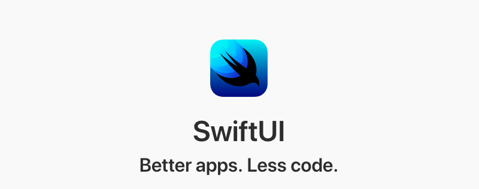
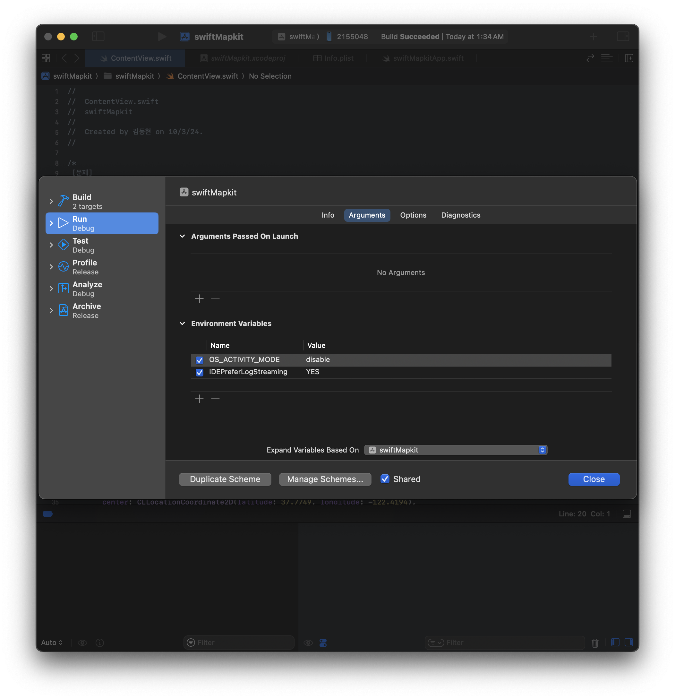

# SwiftUI 5.0 Cheat Sheet



## 목차:

### 기본 요소: 

* <span id="Text_D">텍스트</span>
    - [Text](#Text)
    - [TextField](#TextField)
    - [SecureField](#SecureField) 
    
* <span id="Button_D">버튼</span>
    - [Button](#Button)
    
* <span id="MapKit_D">MapKit</span>
- [MapKit](#MapKit)

# View

<!--### Text-->
<h4 id="Text">Text</h4>

To show a **text** in UI simply write:  
UI에 **텍스트**를 표시하려면 다음과 같이 작성하세요:
``` swift
Text("Hello World")
```
[🔝](#Text_D)

<!--### Button-->
<h4 id="Button"> Button </h4>

`Button` 은, 클릭 이벤트를 발생시키기 위해 사용됩니다.

``` swift
Button(action: {
    // 버튼 액션
}) {
    Text("버튼 이름")
        // 디자인
        .foregroundColor(.white)
        .padding()
        .background(.blue)
        .cornerRadius(10)
}
```
[🔝](#Button_D)


<!--### MapKit-->
<h4 id="MapKit"> MapKit </h4>

MapKit을 통해 지도 출력:  
``` swift
import SwiftUI
import MapKit

struct MapView: View {
    // 초기 위치 설정하는 MKCoordinateRegion
    @State private var region = MKCoordinateRegion(
        center: CLLocationCoordinate2D(latitude: 37.7749, longitude: -122.4194),
        span: MKCoordinateSpan(latitudeDelta: 0.05, longitudeDelta: 0.05)
    )
    
    var body: some View {
        Map(coordinateRegion: $region)  // 지역(region)을 바인딩
            .ignoresSafeArea()          // 전체 화면을 지도로 채우기
    }
}

#Preview {
    MapView()
}
```

<details><summary>사용자의 실시간 위치 업데이트를 관리하기 위해 locationmanager를 생성한 후 MapKit을 통해 지도 출력:  </summary>
<p>

``` swift
import SwiftUI
import MapKit
import CoreLocation

class LocationManager: NSObject, ObservableObject, CLLocationManagerDelegate {
    private var locationManager = CLLocationManager()
    
    @Published var position = MapCameraPosition.region(MKCoordinateRegion(
        center: CLLocationCoordinate2D(latitude: 37.7749, longitude: -122.4194),
        span: MKCoordinateSpan(latitudeDelta: 0.05, longitudeDelta: 0.05)
    ))

    override init() {
        super.init()
        locationManager.delegate = self
        locationManager.requestWhenInUseAuthorization()  // 권한 요청
        locationManager.startUpdatingLocation()
    }
    
    func locationManager(_ manager: CLLocationManager, didUpdateLocations locations: [CLLocation]) {
        if let location = locations.first {
            position = .region(MKCoordinateRegion(
                center: location.coordinate,
                span: MKCoordinateSpan(latitudeDelta: 0.05, longitudeDelta: 0.05)
            ))
        }
    }

    func locationManager(_ manager: CLLocationManager, didFailWithError error: Error) {
        print("위치 업데이트 실패: \(error.localizedDescription)")
    }
}

struct ContentView: View {
    @StateObject private var locationManager = LocationManager()

    var body: some View {
        Map(position: $locationManager.position) {
            // 필요시 사용자 주석이나 추가적인 맵 마커를 여기에 추가
        }
        .ignoresSafeArea()
    }
}

#Preview {
    ContentView()
}
``` 
</p>
</details>


<details><summary>내 위치를 지도에 표시하기(17.0 버전부터 UserAnnotation()방식 채택) </summary>
<p>

``` swift
import SwiftUI
import MapKit
import CoreLocation

class LocationManager: NSObject, ObservableObject, CLLocationManagerDelegate {
    private var locationManager = CLLocationManager()
    
    @Published var position = MapCameraPosition.region(MKCoordinateRegion(
        center: CLLocationCoordinate2D(latitude: 37.7749, longitude: -122.4194),
        span: MKCoordinateSpan(latitudeDelta: 0.05, longitudeDelta: 0.05)
    ))

    override init() {
        super.init()
        locationManager.delegate = self
        locationManager.requestWhenInUseAuthorization()  // 권한 요청
        locationManager.startUpdatingLocation()
    }
    
    func locationManager(_ manager: CLLocationManager, didUpdateLocations locations: [CLLocation]) {
        if let location = locations.first {
            position = .region(MKCoordinateRegion(
                center: location.coordinate,
                span: MKCoordinateSpan(latitudeDelta: 0.05, longitudeDelta: 0.05)
            ))
        }
    }

    func locationManager(_ manager: CLLocationManager, didFailWithError error: Error) {
        print("위치 업데이트 실패: \(error.localizedDescription)")
    }
}

struct ContentView: View {
    @StateObject private var locationManager = LocationManager()

    var body: some View {
        Map(position: $locationManager.position) {
            // 필요시 사용자 주석이나 추가적인 맵 마커를 여기에 추가
            UserAnnotation()
            
        }
        .ignoresSafeArea()
    }
}

#Preview {
    ContentView()
}
``` 
</p>
</details>

<details><summary>처음 위치를 업데이트 한 후에는 추가 업데이트가 카메라 위치를 변경하지 않도록 설정</summary>
<p>

``` swift
import SwiftUI
import MapKit
import CoreLocation

class LocationManager: NSObject, ObservableObject, CLLocationManagerDelegate {
    private var locationManager = CLLocationManager()
    
    // 사용자 위치가 처음 업데이트될 때만 카메라 위치를 업데이트하기 위해 플래그 추가
    private var isFirstUpdate = true
    
    @Published var position = MapCameraPosition.region(MKCoordinateRegion(
        center: CLLocationCoordinate2D(latitude: 37.7749, longitude: -122.4194),
        span: MKCoordinateSpan(latitudeDelta: 0.05, longitudeDelta: 0.05)
    ))

    override init() {
        super.init()
        locationManager.delegate = self
        locationManager.requestWhenInUseAuthorization()  // 권한 요청
        locationManager.startUpdatingLocation()
    }
    
    func locationManager(_ manager: CLLocationManager, didUpdateLocations locations: [CLLocation]) {
        if let location = locations.first, isFirstUpdate {
            position = .region(MKCoordinateRegion(
                center: location.coordinate,
                span: MKCoordinateSpan(latitudeDelta: 0.05, longitudeDelta: 0.05)
            ))
            
            // 처음 업데이트 후에는 다시 원래 자리로 돌아가지 않도록 설정
            isFirstUpdate = false
        }
    }

    func locationManager(_ manager: CLLocationManager, didFailWithError error: Error) {
        print("위치 업데이트 실패: \(error.localizedDescription)")
    }
}

struct ContentView: View {
    @StateObject private var locationManager = LocationManager()

    var body: some View {
        Map(position: $locationManager.position) {
            // 필요시 사용자 주석이나 추가적인 맵 마커를 여기에 추가
            UserAnnotation()
            
        }
        .ignoresSafeArea()
    }
}

#Preview {
    ContentView()
}
```
</p>
</details>


<details><summary>내위치로 이동하는 기능 추가</summary>
<p>

``` swift
import SwiftUI
import MapKit
import CoreLocation

final class LocationManager: NSObject, ObservableObject, CLLocationManagerDelegate {
    private var locationManager = CLLocationManager()
    
    // 사용자 위치가 처음 업데이트될 때만 카메라 위치를 업데이트하기 위해 플래그 추가
    private var isFirstUpdate = true
    
    @Published var position = MapCameraPosition.region(MKCoordinateRegion(
        center: CLLocationCoordinate2D(latitude: 37.7749, longitude: -122.4194),
        span: MKCoordinateSpan(latitudeDelta: 0.05, longitudeDelta: 0.05)
    ))

    override init() {
        super.init()
        locationManager.delegate = self
        locationManager.requestWhenInUseAuthorization()  // 권한 요청
        locationManager.startUpdatingLocation()
    }
    
    func locationManager(_ manager: CLLocationManager, didUpdateLocations locations: [CLLocation]) {
        if let location = locations.first, isFirstUpdate {
            position = .region(MKCoordinateRegion(
                center: location.coordinate,
                span: MKCoordinateSpan(latitudeDelta: 0.05, longitudeDelta: 0.05)
            ))
            
            // 처음 업데이트 후에는 다시 원래 자리로 돌아가지 않도록 설정
            isFirstUpdate = false
        }
    }

    func locationManager(_ manager: CLLocationManager, didFailWithError error: Error) {
        print("위치 업데이트 실패: \(error.localizedDescription)")
    }
    
    // 1) 현재 위치로 이동하는 메소드 추가
    func moveToCurrentLocation() {
        guard let location = locationManager.location else { return }
        
        DispatchQueue.main.async {
            self.position = .region(MKCoordinateRegion(
                center: location.coordinate,
                span: MKCoordinateSpan(latitudeDelta: 0.01, longitudeDelta: 0.01) // span 값을 updateRegionToCurrentLocation 함수와 동일하게 변경
            ))
        }
    }

    // 2) 지도가 움직인후에 현재 위치로 이동하는 메소드
    func moveToCurrentLocation2() {
        if let location = locationManager.location {
            position = .region(MKCoordinateRegion(
                center: location.coordinate,
                span: MKCoordinateSpan(latitudeDelta: 0.05, longitudeDelta: 0.05)
            ))
        }
    }
}

struct ContentView: View {
    @StateObject private var locationManager = LocationManager()

    var body: some View {
        ZStack {
            Map(position: $locationManager.position) {
                // 필요시 사용자 주석이나 추가적인 맵 마커를 여기에 추가
                UserAnnotation()
                
            }
            .ignoresSafeArea()
            
            VStack {
                Spacer()
                Button(action: {
                    locationManager.moveToCurrentLocation()
                }) {
                    Text("내 위치로 이동")
                        .foregroundColor(.white)
                        .padding()
                        .background(.blue)
                        .cornerRadius(10)
                }
            }
            .zIndex(1.0)
        }
    }
}

#Preview {
    ContentView()
}
```
</p>
</details>

<details><summary>Mapkit 경고 해결방법</summary>
<p>

``` swift
/*
 [문제]
 CLLocationManager(<CLLocationManager: 0x3005b8570>) for <MKCoreLocationProvider: 0x3029a8300> did fail with error: Error Domain=kCLErrorDomain Code=1 "(null)"
 [문제]
 Missing MeshRenderables for ground mesh layer for (4/4) of ground tiles. Tile debug info: (Key: 654.1583.12.255 t:33 kt:0, Has mesh errors: 0, MeshInstance count: 6, PendingMaterial count: 6, Invisible MeshInstances count: 0 | Key: 655.1582.12.255 t:33 kt:0, Has mesh errors: 1, MeshInstance count: 536, PendingMaterial count: 536, Invisible MeshInstances count: 0 | Key: 654.1582.12.255 t:33 kt:0, Has mesh errors: 0, MeshInstance count: 312, PendingMaterial count: 312, Invisible MeshInstances count: 0 | Key: 655.1583.12.255 t:33 kt:0, Has mesh errors: 0, MeshInstance count: 270, PendingMaterial count: 270, Invisible MeshInstances count: 0)
 
 [해결]
 <key>NSLocationWhenInUseUsageDescription</key>
 <string>사용자의 위치를 확인하기 위해 위치 권한이 필요합니다.</string>
 <key>NSLocationAlwaysUsageDescription</key>
 <string>위치를 항상 확인하기 위해 권한이 필요합니다.</string>
 */
``` 
[해결2]


</p>
</details>
[🔝](#MapKit_D)
